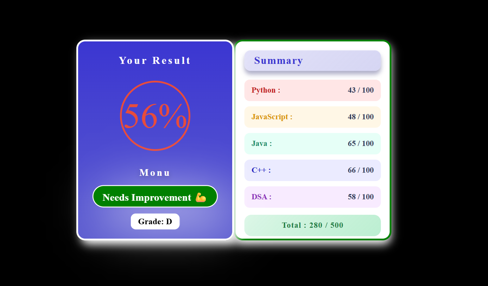

# result-summary-component
A simple result summary UI built with HTML, CSS, and JavaScript, focusing on layout, styling, and user interaction.
# Result Summary Component

A simple and interactive **Result Summary UI component** built using **HTML, CSS, and JavaScript**.  
This project focuses on layout control, styling, hover interactions, and basic user input handling.

---

## ✨ Features

- Name input with validation before viewing results
- Random marks generation (minimum 33 marks per subject)
- Automatic total & percentage calculation (out of 500)
- Grade and performance message based on percentage
- Color-changing result circle (Green / Yellow / Red)
- Interactive hover effect with sliding summary panel
- Clean and responsive UI design

---

## 🛠️ Built With

- **HTML5**
- **CSS3**
- **Vanilla JavaScript**

---

## 🚀 Live Demo

👉 https://your-username.github.io/result-summary-component/

---

## 📂 Project Structure
```
result-summary-component/
│
├── index.html
├── style.css
├── logic.js
└── README.md
```

---

## 📸 Preview

---

## 🧠 Learning Focus

- CSS Flexbox & layout positioning
- Hover interactions and transitions
- JavaScript DOM manipulation
- Input validation & conditional logic
- UI state handling

---

## 📌 Notes

This project is created for **practice and learning purposes** and is a part of frontend UI development practice.

---

## 📄 License

This project is open-source and free to use.
